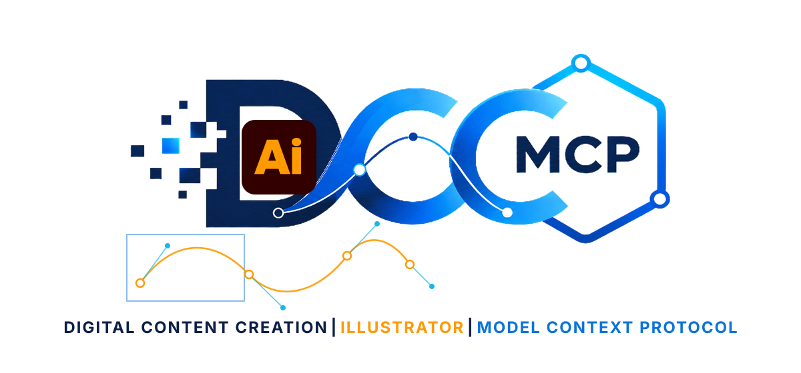

# dcc-mcp-illustrator

<p align="center">
  
</p>

MCP adapter for Adobe Illustrator, built on the shared `adobepy` broker, CEP
bridge, typed facade, and complete structured official DOM.


<sub>Workflow illustration generated with OpenAI image generation; no third-party source assets.</sub>

```bash
pip install dcc-mcp-illustrator
adobepy install-bridge illustrator --dest <extension-dir> --token <token>
dcc-mcp-illustrator
```

Set `ADOBEPY_TOKEN` to the same non-default token used to install the bridge.
The adapter uses an OS-assigned port and registers with DCC-MCP discovery;
`DCC_MCP_ILLUSTRATOR_PORT` is only needed for a fixed direct endpoint.

The adapter reports ready only after the target Illustrator bridge advertises
the complete typed/official-DOM contract and a real host version RPC succeeds.
A broker process is stopped only when it was started by this adapter.

## Agent workflow

Use the typed DCC-MCP CLI path for discovery and calls:

```bash
dcc-mcp-cli dcc-types
dcc-mcp-cli list
dcc-mcp-cli load-skill illustrator-document --dcc-type illustrator
dcc-mcp-cli search --query "inspect selected paths" --dcc-type illustrator
dcc-mcp-cli call <tool-slug> --dcc-type illustrator --json '{"key":"value"}'
```

## Skill groups

- `illustrator-document`: create RGB/CMYK documents; inspect documents,
  artboards, layers, selections, vector/placed/raster items, text frames,
  stories, and swatches.
- `illustrator-artwork`: create named RGB rectangles and point text; inspect
  named items, edit text, and update path points, translation, scale, and
  rotation.
- `illustrator-export`: save AI/PDF/EPS documents and export PNG/JPEG/SVG or
  other Illustrator-supported formats.
- `illustrator-advanced`: structured access to the complete official object
  model. Raw ExtendScript is an explicit destructive fallback, not the primary
  API.

Structured DOM references are opaque and session-scoped. Never persist or reuse
them after a bridge restart or `release` operation.

## Real-host acceptance

The production validation path starts from an empty 640×360 RGB document,
creates named vector and text objects through typed tools, verifies the active
document and item counts, saves the native AI document, and exports a rendered
PNG. Readiness requires all six process, DCC, catalog, dispatcher, host bridge,
and main-thread executor checks before mutations run.
